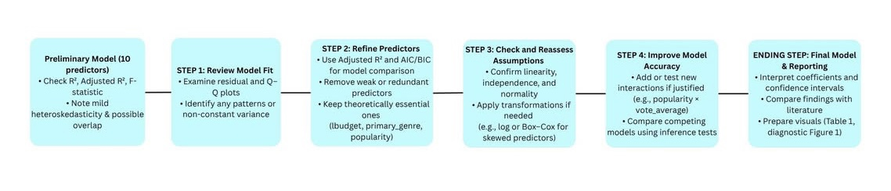

```{r setup, include=FALSE}
knitr::opts_chunk$set(echo = FALSE)

library(tidyverse)
library(dplyr)
library(knitr)
```

```{r import, include=FALSE}
movies <- read_csv("tmdb_5000_movies.csv") %>%
  mutate(
    release_year  = as.integer(substr(release_date, 1, 4)),
    primary_genre = stringr::str_match(genres, '"name"\\s*:\\s*"([^"]+)"')[,2],
    is_english    = as.integer(original_language == "en"),       
    has_homepage  = as.integer(!is.na(homepage) & homepage != "")
  ) %>%
  filter(budget > 0, revenue > 0, !is.na(primary_genre))
```

# Contributions

**Introduction:** Khangerel Batzul

**Data Description:** Kevin Cheung

**Ethics Discussion:** Khangerel Batzul

**Preliminary Results:** Andrew Batmunkh

**Analysis Plan:** Andrew Batmunkh


# Introduction
The film industry is one of the most data-rich creative sectors of cultural and economic production. It generates billions in worldwide revenue each year with its success depending on a complex combination of quality, budget, cast and many more. With the availability of large datasets like the TMDB 5000 Movie Dataset, researchers can now study the factors that contribute to a film’s success, providing further insight about trends in media production for producers and studios. This project explores the question “ How do movie characteristics influence the financial success of films?” Using the aforementioned dataset, we aim to identify which factors best predict box office revenue. 

This project applies Multiple Linear Regression (MLR) to investigate the relationship between multiple continuous and categorical predictors (e.g., budget, runtime, genre) and a continuous response variable (e.g., revenue). Using linear regression allows us to estimate average change in success associated with each predictor, using estimated coefficients, confidence intervals, and p-values. Unlike simple correlations that don’t account for a multivariate nature or confounding factors, linear regression is ideal for addressing questions of significance and contribution. 

Previous research supports the relevance of this question and its variables. Nelson and Glotfelty (2012) found that production budgets, star power, and viewer ratings significantly explain variation in box office return. The primary focus was to quantify the financial value of star power in the film industry. On the other hand, Hsu (2006) examined the role of genre and audience perception in a film’s market performance. The findings suggested that while multi-genre films attract wider audiences,they generally receive lower ratings due to the harder categorization, highlighting the significance of genre identity and audience appeal on critical success. Liu (2006) finds that over time, the quantity of discussion or word-of-mouth determines a film’s financial success more than whether the conversation is favorable or not. These findings show that financial and critical success depend on multiple interacting factors, and not just one or the other, emphasizing their unique contributions. This supports our decision to include a broader set of predictors to better understand what drives movie performance and how these interactions can be effectively modeled through linear regression. 

This analysis could help film studios, producers and marketing teams make data-driven decisions. This study offers a quantifiable way to predict performance and use resources more effectively by showing how different factors affect overall success. Researchers and marketers can also use these predictions to better understand how trends in the entertainment industry are evolving. 


# Data Description

We use the TMDb 5000 Movies dataset from Kaggle (https://www.kaggle.com/datasets/tmdb/tmdb-movie-metadata). The data are from The Movie Database (TMDb). TMDb is a film catalog that gathers movie metadata by user and partner submissions. TMDb helps movie fans find accurate, structured details like title, release date, runtime, genres, budget and revenue.   

Our response variable is revenue. After filtering to movies with positive revenue, revenue contains 3228 observations with no missing values. The range is 5 to 2787965087 dollars with mean 121279999 and standard deviation 186319835. The first quartile is 17000000, the median is 55191503 and the third quartile is 146343450. This response variable is suitable for use in a linear model. First, revenue is continuous. Also, each movie is mostly treated as an independent observation. However, some movies might still be related. For example, films from the same franchise, made by the same production team. 
Budget is right-skewed and includes 216 outliers. The variance is large relative to the mean. Popularity and vote_count are also highly right-skewed with 175 and 305 outliers respectively and high variance. Runtime displays a mild right tail with 99 outliers. Vote_average appears near-symmetric and lies within the bounded range from 0 to 10. Release_year covers several decades and contains 203 outliers. 

The reason for the choice of interacted predictors is that spending affects each genre differently. Prior research shows genre-specific returns to investment. For example, horror often delivers high ROI (Novoseltsev, 2015), so allowing the budget slope to vary by genre captures those divergent returns. Therefore, we include a budget and primary_genre interaction. 
```{r snapshot}
num_vars <- c("budget","runtime","popularity","vote_average",
              "vote_count","release_year")

num_summary <- movies %>%
  select(all_of(num_vars)) %>%
  pivot_longer(everything(), names_to = "variable", values_to = "x") %>%
  group_by(variable) %>%
  summarise(
    n      = sum(!is.na(x)),
    mean   = mean(x, na.rm = TRUE),
    sd     = sd(x, na.rm = TRUE),
    min    = min(x, na.rm = TRUE),
    q1     = quantile(x, .25, na.rm = TRUE),
    median = median(x, na.rm = TRUE),
    q3     = quantile(x, .75, na.rm = TRUE),
    max    = max(x, na.rm = TRUE),
    outliers = {
      q1_ <- quantile(x, .25, na.rm = TRUE); q3_ <- quantile(x, .75, na.rm = TRUE)
      iqr_ <- q3_ - q1_; sum(x < (q1_ - 1.5*iqr_) | x > (q3_ + 1.5*iqr_), na.rm = TRUE)
    }
  ) %>%
  mutate(across(where(is.double), ~ round(.x, 2)))

kable(num_summary, 
      caption = "Summary statistics for numerical predictors in the preliminary model.",
      col.names = c("Variable", "N", "Mean", "SD", "Min", "Q1", "Median", "Q3", "Max", "Outliers"))
```

\newpage
 
# Ethics Discussion

Our dataset, TMDB 5000 Movies, is public and open-access, with its metadata collected through verified users and partner submissions via the TMDB API. With this open-license system, the collection methods can be considered reasonably trustworthy because of its transparency and reproducibility. The easily accessible data also ensures accountability. However, the user-based data has potential risks of inconsistency and incompleteness, especially for older or smaller films. For example, niche films may lack detailed records, making the dataset more reflective of mainstream cinema. 

The dataset respects autonomy and informed consent. As previously mentioned, voluntary users contribute to the TMDB data, meaning there’s minimal ethical risks related to personal privacy violations or unconsented data extraction. Similarly, the data collects descriptive information about movies only with no mention of confidential details, reinforcing its compliance with ethical principles. Kaggle’s distribution of the dataset also maintains data integrity recognizing when and where credit is due. 

Despite all this, representational bias is a key limitation in the dataset. Being mainly made up of Hollywood films in English, the dataset leaves international films underrepresented. As a result, models may overrepresent Western characteristics and patterns, limiting the scope of applicability . There may also be bias in TMBD’s popularity metric, as its ratings are tailored to its users rather than the general public. WIth this in mind, it is essential to acknowledge such biases when interpreting our model outcomes. 
From an ethical standpoint, we are using the data for educational and non-commercial purposes, in accordance with TMDB’s terms of use and principle of proportionality. The goal of our analysis is to understand trends in success and not to evaluate individuals. To uphold both ethical and statistical integrity, we acknowledge the need to maintain transparency, accurate citations and representational biases. 
 
\newpage

# Preliminary Results

```{r model-fit, include=FALSE}
fit_revenue <- lm(revenue ~ budget + runtime + popularity + vote_average + vote_count + release_year + is_english + has_homepage +
primary_genre + budget:primary_genre, data = movies)

summary(fit_revenue)
```

```{r residual-plots, fig.cap="Residual diagnostics for the preliminary multiple linear regression predicting revenue using 10 predictors: budget, runtime, release_year, popularity, vote_count, vote_average, is_english, has_homepage, primary_genre, and budget×primary_genre. Model based on n = 3,228 observation with Adjusted R² = 0.7125, F-statistic = 186.9, p < 2.2×10⁻¹⁶. Figure shows 4 separate plots: (A) Scale–Location, (B) Normal Q–Q Plot, (C) Residuals vs Fitted, and (D) Residuals vs Leverage with Cook’s distance contours.", fig.width=8, fig.height=8, warning=FALSE}
par(mfrow = c(2, 2))
plot(fit_revenue)
```

```{r coefficient-table}
results_table <- data.frame(
  Predictor = c("Intercept", "Budget", "Runtime (min)", "Popularity", 
                "Vote average", "Vote count", "Release year", "English-language",
                "Has homepage", "Primary_genre_Drama", "Primary_genre_Documentary",
                "Primary_genre_Horror", "Primary_genre_Romance", 
                "Budget:Primary_genre_Drama", "Budget:Primary_genre_Documentary",
                "Budget:Primary_genre_Horror", "Budget:Primary_genre_Romance"),
  Estimate = c(1837000000, 1.845, 295600, 288800, -6263000, 65920, -937000, -3645000,
               3326000, 28550000, 64990000, 49120000, 43020000, -0.5095, -0.7866, 
               -1.146, -0.1869),
  Std_Error = c(323700000, 0.08815, 105900, 74420, 2651000, 2240, 158800, 9432000,
                3998000, 8143000, 23340000, 11720000, 19570000, 0.1532, 2.495, 
                0.4276, 0.4941),
  t_value = c(5.675, 20.933, 2.791, 3.881, -2.363, 29.436, -5.9, -0.386,
              0.832, 3.506, 2.784, 4.189, 2.198, -3.325, -0.315, -2.68, -0.378),
  p_value = c("1.51E-08", "< 2e-16", "0.005", "0.0001", "0.018", "< 2e-16", 
              "4.02E-09", "0.699", "0.406", "0.0005", "0.005", "2.87E-05", 
              "0.028", "0.0009", "0.753", "0.007", "0.705"),
  Conf_Low = c(1202548000, 1.672, 88036, 142937, -11458960, 61530, -1248248, -22131720,
               -4510080, 12589720, 19243600, 26148800, 4662800, -0.810, -5.677, 
               -1.984, -1.155),
  Conf_High = c(2471452000, 2.018, 503164, 434663, -1067040, 70310, -625752, 14841720,
                11162080, 44510280, 110736400, 72091200, 81377200, -0.209, 4.104, 
                -0.308, 0.782),
  Significance = c("***", "***", "**", "***", "*", "***", "***", "",
                   "", "***", "**", "***", "*", "***", "", "**", "")
)

kable(results_table,
      caption = "Preliminary multiple linear regression results predicting revenue. Standard errors and 95% confidence intervals are included. Only significant predictors (p < 0.05) and key continuous variables are shown.",
      col.names = c("Predictor", "Estimate", "Std Error", "t-value", "p-value", 
                    "CI Lower", "CI Upper", "Sig."),
      align = c("l", "r", "r", "r", "r", "r", "r", "c"),
      row.names = FALSE)
```
\newpage


For our prediction of revenue, we fitted a multiple linear regression model with ten predictors: seven numerical budget, runtime, release_year, popularity, vote_count, vote_average, is_english) and three categorical (has_homepage, primary_genre, and budget × primary_genre). These variables predict how production scale, audience engagement, and genre influence revenue The model explains 72% of the variance in revenue (R² = 0.716, Adjusted R² = 0.713) with an RSE of 9991000 (df = 3,184) and (F-Statistic = 186.9, p < 2.2×10⁻¹⁶).

Table 1 shows that movie revenue depends on several key factors. Budget, popularity and vote count all raise earnings, supporting Liu (2006)’s finding that visibility and audience support can cause box office success. However, vote average ($\beta$ = −6.26M) and release year ($\beta$ = −937,000) suggest newer or more focused films may earn less. Genres like Drama, Documentary, Horror, and Romance perform well, though negative budget interactions (e.g., budget × Drama $\beta$ = −0.51, budget × Horror $\beta$ = −1.15) could suggest lower returns with higher spending.

Categorical predictors show clear genre effects. In Table 1, Drama, Documentary, Horror, and Romance all have positive, significant coefficients, meaning higher average box office revenue compared to the baseline genre, holding other variables constant. The interaction between budget and genre suggests that higher spending leads to loss of gains for Horror and Documentary films but smaller losses for Romance and Drama genres, reflecting how production costs and returns scale differently across categories.

Figure 1 shows that model assumptions are partly met. The residuals vs. fitted plot reveals clustering, suggesting groups of films with similar revenues and heteroskedasticity as variance increases. The scale–location plot confirms this pattern, showing wider spread at higher fitted values. The Q–Q plot indicates heavy tails and non-normal residuals, while the leverage plot highlights several high-influence outliers, likely major blockbusters. These results suggest violations in model assumption in raw-scale models, indicating a need for transformation

# Analysis Plan

```{r flowchart, fig.cap="Flowchart summarizing the planned steps for refining and finalizing the multiple linear regression model predicting revenue.", out.width="80%", fig.align="center"}

```

Continuing on our preliminary model, the next part of this project will focus on refining and validating the multiple linear regression predicting revenue. Our current cleaned model allows basic linear assumptions but shows mild heteroskedasticity and potential redundancy among correlated predictors. With the concepts covered up to Module 6, we will aim to test, and re-evaluate the model to improve accuracy and interpretability.

We will begin by refining the preliminary model, reviewing overall model fit and diagnostic results from the residual plots provided in Figure 1. This includes examining the Residuals vs. Fitted plot for signs of non-linearity or non-constant variance and the Q–Q plot to evaluate the normality of residuals. Any noticeable curvature or fan-shaped patterns would indicate mild heteroskedasticity. To improve model performance, we will compare several refined models using an improved Adjusted R² and AIC/BIC as selection criteria. Predictors with weak statistical significance or minimal contribution to explanatory power will be considered for removal to improve better prediction , while also ensuring that our key predictors of budget, primary_genre, and popularity will remain in all versions, as these variables consistently explain a large portion of revenue variation in both our results and prior research (Liu, 2006; Hsu, 2006; Nelson & Glotfelty, 2012).

Model assumptions will be checked after every major adjustment using residual and Q–Q plots. Because the residuals showed mild heteroskedasticity, we will test different transformations such as Box–Cox and check the lambda for the most sufficient transformation and fix for skewed predictors like vote_count or popularity. We may also explore additional interaction terms (e.g., popularity × vote_average) to capture audience behavior more accurately

## Timeline and Responsibilities

**Week 1: Model Refinement (10/30 - 11/4)** 

- Refine model using AIC/BIC, apply transformations, and check assumptions - Andrew Batmunkh

- Review context for predictor decisions - Khangerel Batzul  
- Test transformations (Box-Cox) and prepare transformed data - Kevin Cheung 

**Week 2: Finalize Analysis (11/6 - 11/12)**

- Finalize model, create coefficient tables and diagnostic plots - Andrew Batmunkh

- Check assumptions on final model and prepare data summaries - Kevin Cheung

- Interpret results and compare findings to literature - Khangerel Batzul

**Week 3: Poster Creation (11/13 - 11/19)**

- Design poster layout, write poster text, and interpretations - Khangerel Batzul

- Create technical content and data-related content (model tables, diagnostic figures) for poster - Andrew Batmunkh

- Poster formatting and data-related content - Kevin Cheung

**Week 4: Finalize and Present** (11/20 - 11/27)

- Complete poster - All Members

- Record presentation video - All Members

- Final review and submission by November 28th - All Members

\newpage

# Bibliography

Hsu, G. (2006). Jacks of all trades and masters of none: Audiences' reactions to spanning genres in feature film production. Administrative Science Quarterly, 51(3), 420–450. https://doi.org/10.2189/asqu.51.3.420

Liu, Y. (2006). Word of mouth for movies: Its dynamics and impact on box office revenue. Journal of Marketing, 70(3), 74–89. https://doi.org/10.1509/jmkg.70.3.74

Nelson, R. A., & Glotfelty, R. (2012). Movie stars and box office revenues: An empirical analysis. Journal of Cultural Economics, 36(2), 141–166. https://doi.org/10.1007/s10824-012-9159-5

Novoseltsev, M. (2015, October 6). Cinema: Analysis of genres and plot texts and their impact on "box office" performance [Project work, DAS Data Science, School of Engineering]. Zurich University of Applied Sciences (ZHAW). https://www.zhaw.ch/storage/engineering/institute-zentren/cai/DAS15_Movie_Performance_Novoseltsev.pdf
